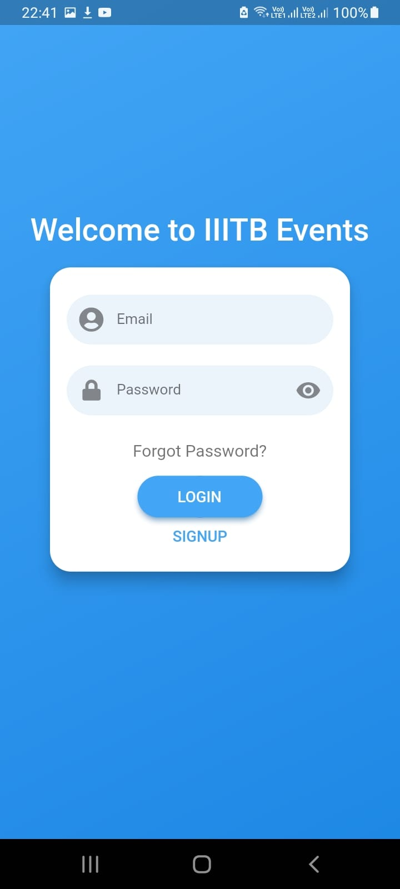
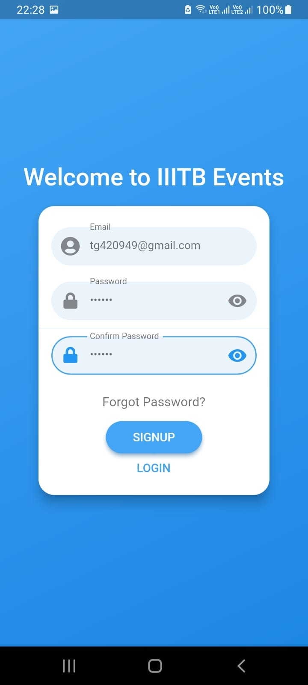

# IIITB Events

This app is made for the students and event organizers(admins) to manage all the details about the attendees of a particular event.

This app has two main features:

## 1. Events

The admins can share the details of events that will be happening in our college/online  with the students through creating an event. The structure/model of a event includes its title, description, start date, end date and media attachments.

## 2. Forms

The admins can also create forms with a bunch of questions and they will be able to view the responses of the students. Also, there is total submissions count and remaining submissions count for every form that helps in keeping count of the attendees. There is also chart analysis button for the questions of checkbox and radio button types.

- To run the flutter project in your local system, refer to [the official documentation of the flutter team](https://docs.flutter.dev/development/tools/android-studio) 

- To download the apk, [click here](https://drive.google.com/file/d/1gLUgiU4sPkjtuVUtvPIU6thk14hbxFwP/view?usp=sharing).

- Adding some screenshots of the app

               